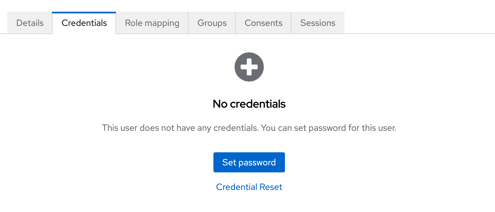

import { Steps } from '@astrojs/starlight/components';

## Accessing Keycloak User Dashboard

<Steps>

1. Log into your keycloak domain admin/meru/console using same credentials as Meru. (realm manager role is required, otherwise user will be caught in a loop.)

</Steps>

## Creating Users

<Steps>

1. Ideally, users will register themselves by clicking on the **register** button on the Meru login page.
2. Open the left menu bar and you’ll see **Users** and **Groups**. We will only be working with the **Users** tab.
3. Click on the **Add User** button.
4. For **Required user actions**, select **Update Password**. *This requires the new user to change the default password you create.*
5. For **Email Verified**, only toggle this to **Yes** if you know that the email address exists and is spelled correctly. Otherwise the user can verify their address on setup, we recommend erring on leaving this unchecked.
6. Add the user’s email address to the **Email** field.
7. Add first and last name.
8. Ignore **groups**.
9. Click **Create.**
10. Go to the user and click on the **Credentials** tab at the top.
11. Click on the **Set password** button.

12. Add a temporary password, we recommend `changeme` all lowercase and one word. Repeat for the confirmation field and make sure **Temporary** is set to **On**.
13. Click the **Save** button, and then the **Save password** button.
14. Next go to the **Role mapping** tab at the top.
15. Click on the **Assign role** button. The two roles that are relevant are `global_admin` and `realm_manager`.
    1. *Global admin has access to everything in Meru, can create entities, harvest, etc.*
    2. *Realm manager has the ability to come into this section of keycloak and administer users from this side. They can also lock everyone else out so this is a privileged role.*
    3. *Ignore* `default-roles-meru`.
16. Once you have selected one or both of the roles, click **Assign**.
</Steps>

## Resetting User Passwords

<Steps>

1. Go to the **Users** tab in the left menu.
2. Click on the email of the user whose address you would like to change.
3. Go to the **Credentials** tab at the top.
4. Click on the **Reset password** button.
5. Add a temporary password, we recommend `changeme` all lowercase and one word. Repeat for the confirmation field and make sure **Temporary** is set to **On**.
6. Click the **Save** button, and then the **Reset password** button.

</Steps>

## Removing or Disabling Users

<Steps>

1. We recommend disabling users instead of deleting them when possible.
2. To disable a user, click on the **Enabled** toggle in the top right of the user page, above the tab menu. *This keeps the user record intact, but prevents them from logging in.*
3. To delete a user, click on the **Action** dropdown at the top right, next to the Enabled toggle.
4. Click **Delete**.

</Steps>

## User Detail Updates

If a user would like to update their name or other details, they can do so via the Edit Profile button at the top right of the main navigation in Meru.
