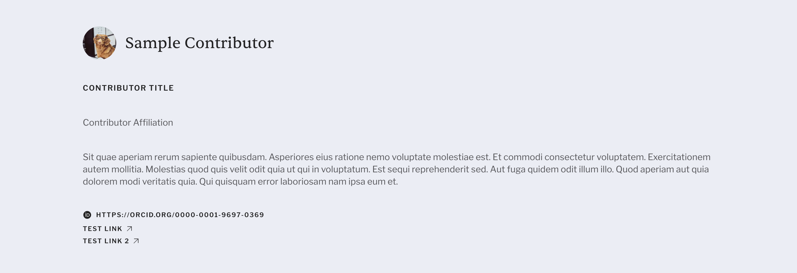

import { Steps, Badge } from "@astrojs/starlight/components";

## Manage Users

*Creating and removing users, as well as assigning administation privileges, is handled through the [Keycloak user dashboard](/guides/keycloak#creating-users), or users can register their own account directly from the Meru login screen. This section focuses on managing users after they've been created—resetting passwords, updating user details, and managing associated communities, collections, or items.*

### Access User List

<Steps>

1. Log in to the Meru Admin.
2. To get to the user list, go to **Manage** in the main navigation and click on **Users**.

    <Badge text="Note" variant="note" /> _Only those with `global_admin` privileges can edit user accounts._

3. The main page will show a list of all users in your Meru instance. You’ll see each user's name, email address, admin status, and creation date.

</Steps>

### Reset a User Password

<Steps>

1. From the main user list, click on the name of the user whose password you’d like to reset.
2. In the top right of the user dashboard, click the **Reset password 🔗** button.
3. A modal will appear confirming that a password reset email will be sent to the user. Click **Send email**.

</Steps>

### Update User Details

<Steps>

1. From the main user list, click on the name of the user whose details you’d like to update.
2. In the left side of the user dashboard, make sure the **Details** tab is selected.
3. Update the user’s **first name**, **last name**, or **email**.
4. Upload a user avatar. See the [image uploading guidelines](/reference/image-guide) for sizing recommendations.

</Steps>

### Manage Community Access

<Steps>

1. From the main user list, click on the name of the user whose communities you’d like to update.
2. In the left side of the user dashboard, make sure the **Communities** tab is selected.

</Steps>

#### Add New Community Access

<Steps>

1. At the top right of the page, underneath the **Reset password 🔗** button, click on **Add Community +**.
2. In the drawer, select an existing community and assign a role for the user within that community.
3. Click **Save**.

</Steps>

#### Update an Existing Community Access

<Steps>

1. Hover over the community name that you would like to update.
2. To remove the community, click on the button with the trash icon, and click **Delete**.
3. To update the role for the user within that community, click on the button with the pencil icon. Select the new role from the dropdown menu and click **Save**.
4. Click on the community name to navigate to that community's detail page.

</Steps>

### Manage Collection Access

<Steps>

1. From the main user list, click on the name of the user whose collections you’d like to update.
2. In the left side of the user dashboard, make sure the **Collections** tab is selected.

</Steps>

#### Add New Collection Access

<Steps>

1. At the top right of the page, underneath the **Reset password 🔗** button, click on **Add Collection +**.
2. In the drawer, select an existing collection and assign a role for the user within that collection.
3. Click **Save**.

</Steps>

#### Update an Existing Collection Access

<Steps>

1. Hover over the collection name that you would like to update.
2. To remove the collection access, click on the button with the trash icon, and click **Delete**.
3. To update the role for the user within that collection, click on the button with the pencil icon. Select the new role from the dropdown menu and click **Save**.
4. Click on the collection name to navigate to that collection's detail page.

</Steps>

---

### Manage Items Access

<Steps>

1. From the main user list, click on the name of the user whose items you’d like to update.
2. In the left side of the user dashboard, make sure the **Items** tab is selected.

</Steps>

#### Add New Item Access

<Steps>

1. At the top right of the page, underneath the **Reset password 🔗** button, click on **Add Item +**.
2. In the drawer, select an existing item and assign a role for the user within that item.
3. Click **Save**.

</Steps>

#### Update an Existing Item Access

<Steps>

1. Hover over the item name that you would like to update.
2. To remove the item access, click on the button with the trash icon, and click **Delete**.
3. To update the role for the user within that item, click on the button with the pencil icon. Select the new role from the dropdown menu and click **Save**.
4. Click on the item name to navigate to that item's detail page.

</Steps>

## Manage Contributors

*In most cases, contributors are automatically created via the harvesting process and don't need to be added by hand. However, Creating, editing, and removing contributors, both individual people and organizations, can also be done through the Contributors section of the Meru Admin. This section covers the full lifecycle of managing contributor records: creating new contributors, editing contributor details, managing their affiliations and contributions, viewing contributor profiles on the public site, and deleting contributors when needed.*

### Access Contributor List

<Steps>

1. Log in to the Meru Admin.
2. To get to the contributor list, go to **Manage** in the main navigation and click on **Contributors**.
3. The main page will show a list of all contributors in your Meru instance. You’ll see each contributor's name, affiliation, contributions, and creation date.

</Steps>

### Create a New Contributor

<Steps>

1. Determine whether your contributor is a person or organization.
2. Click **Create person +** or **Create organization +** at the top right of the Contributors page.
3. Fill in the required fields: **First name** and **Last name**.
4. If you would like to upload an image, see the [image uploading guidelines](/reference/image-guide) for sizing recommendations.
5. Add any additional details:
    - Title
    - Affiliation
    - Email
    - ORCID Link
    - Bio
    - Additional links
6. Click **Save**.

</Steps>

<Badge text="Note" variant="note" /> *Here is what those details will look like on the contributer details page:*

### Manage Existing Contributors

#### View Contributor Detail Page

<Steps>

1. In the contributor list, hover over the contributor you want to view.
2. Click on the button with the diagonally pointing up arrow ↗.

</Steps>

<Badge text="Note" variant="note" /> *This will navigate you out of admin and to the public contributor page on the frontend.*

#### Delete a Contributor

<Steps>

1. In the contributor list, hover over the contributor you want to view.
2. Click on the button with the trash icon.
3. Click **Delete**.

</Steps>

#### Edit Contributor Details

There are two ways to edit a contributor:
- **Quick edit drawer** — *useful for making simple updates to contributor details.*
- **Full contributor page** — *allows editing details as well as managing collection and item contributions.*

**_Quick Edit Drawer_**

<Steps>

1. In the **Contributors** list, hover over the contributor you want to edit.
2. Click on the **Edit ✏️** button that appears.
3. Make any updates to the contributor details in the drawer.
4. Click **Save**.

</Steps>

**_Full Contributor Page_**

<Steps>

1. In the **Contributors** list, click on the contributor’s name to open their full profile page.
2. Use the navigation menu on the left to access **Details**.
3. Make any updates as needed on the **Details** tab.
4. Click **Save**.

</Steps>

#### Edit Contributions

**_Create Contribution_**

<Steps>

1. In the **Contributors** list, click on the contributor’s name to open their full profile page.
2. Use the navigation menu on the left to access **Collections** or **Items**.
3. Click **Create contribution +** at the top right of the page.
4. Fill in the required field: **Collection**.
5. Add any additional details:
    - Role
    - Role position
    - Overall position
6. Click **Save**.

</Steps>

**_Edit Contribution_**

<Steps>

1. In the **Contributors** list, click on the contributor’s name to open their full profile page.
2. Use the navigation menu on the left to access **Collections** or **Items**.
3. Hover over the contribution name that you would like to update.
4. To update the position details for the user within that contribution, click on the button with the pencil icon. Make the desired changes and click **Save**. Role cannot be updated. To change a contributors role on entity, the contribution has to be deleted and a new one created.
5. Click on the community name to navigate to that community's detail page.

</Steps>